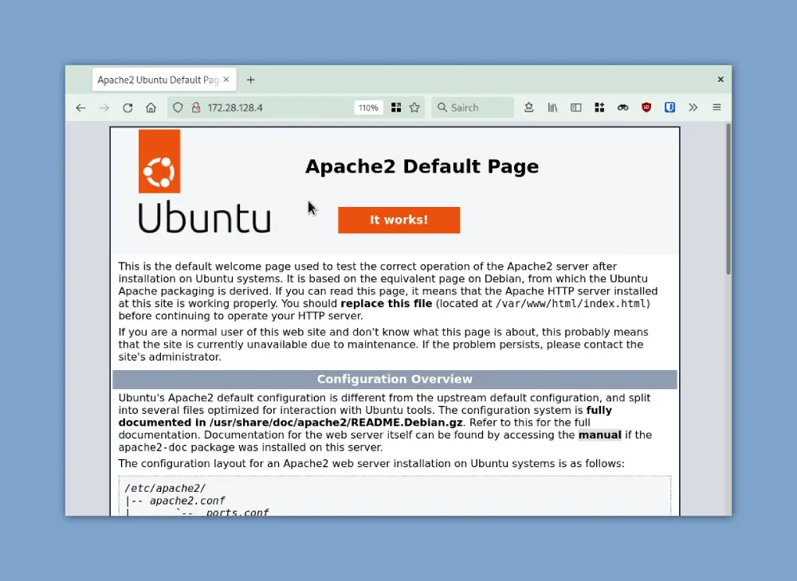

# Run a web server in a Linux VM with Vagrant ([original source](https://www.tutorialworks.com/linux-vm-vagrant/))

### Step-1: Install the required software
[VirtualBox](https://www.virtualbox.org/)

[Vagrant](https://www.vagrantup.com/)

### Step-2: Create and start an Ubuntu Linux VM with Vagrant
Open new direction and go there

    mkdir myproject
    cd myproject


Create vagrant box

    vagrant init ubuntu/focal64

```jammy64 - 22.04``` ```focal64 - 20.04``` etc.

Boot up virtual machine

    vagrant up

### Step-3: Install the web server
Install Apache

    sudo apt update
    sudo apt install apache2


Check if Apache is running

    systemctl status apache2

the result should show something like that:

    ● apache2.service - The Apache HTTP Server
         Loaded: loaded (/lib/systemd/system/apache2.service; enabled; vendor preset: enabled)
         Active: active (running) since Thu 2023-03-02 11:20:34 UTC; 36min ago
           Docs: https://httpd.apache.org/docs/2.4/
       Main PID: 3044 (apache2)
          Tasks: 55 (limit: 1131)
         Memory: 5.7M
         CGroup: /system.slice/apache2.service
                 ├─3044 /usr/sbin/apache2 -k start
                 ├─3046 /usr/sbin/apache2 -k start
                 └─3047 /usr/sbin/apache2 -k start

One more method to check with ```curl```:
    
    curl -v localhost:80

### Step-4: working for our VM

#### How do we access the website?

A web server serves content to users, over the internet.

To do this, it listens on a specific **port** on the server. Usually, web servers listen on port **80**.

To access our web server from outside the VM, we’ll need to give the VM an IP address that we can reach from outside the VM.

#### How to see your VM’s network configuration

Inside the SSH session, type:

    ip addr

Gives available network interfaces:

    1: lo: <LOOPBACK,UP,LOWER_UP> mtu 65536 qdisc noqueue state UNKNOWN group default qlen 1000
    link/loopback 00:00:00:00:00:00 brd 00:00:00:00:00:00
    inet 127.0.0.1/8 scope host lo
       valid_lft forever preferred_lft forever
    inet6 ::1/128 scope host 
       valid_lft forever preferred_lft forever
    2: enp0s3: <BROADCAST,MULTICAST,UP,LOWER_UP> mtu 1500 qdisc fq_codel state UP group default qlen 1000
        link/ether 02:cd:6a:13:84:49 brd ff:ff:ff:ff:ff:ff
        inet 10.0.2.15/24 brd 10.0.2.255 scope global dynamic enp0s3
           valid_lft 83928sec preferred_lft 83928sec
        inet6 fe80::cd:6aff:fe13:8449/64 scope link 
           valid_lft forever preferred_lft forever

```127.0.0.1```, which is an IP address that machines use to refer to themselves. You use this IP address when you want to access something on the machine, from the machine itself! Also called “localhost”.

```10.0.2.15``` (ignore the bit after the ```/``` for now). This is the machine’s IP address that it uses to identify itself to the network. We can use this to access it from our host computer.

Since, your VMs IP address is obvious, you might think that you can connect this from your host.

But, you can't.

Here’s why:

**I tried the IP address but it’s ‘NAT’ working…**

By default, VirtualBox configures your virtual machine with a network configuration called **Network Address Translation** (NAT).

NAT is a way to connect computers to a network, so that a machine can “see outside” (to the network & the internet), but to other machines, it appears invisible and unreachable.

(This is like how your laptop connects to your internet router at home.)

So, we need to change the network configuration, so that the machine is reachable.

**Using DHCP instead**

There are a few different ways that we can “expose” the web server to the outside world.

We’re going to use a type of network configuration called **DHCP**, or Dynamic Host Configuration Protocol.

With DHCP, the virtual machine will be assigned a reachable IP address when it starts up.

(This is like how your internet router works! It gets assigned an IP address by your ISP when it switches on.)

Let’s do it.


### Step-5: Configuring the VM’s network connection

#### Set the virtual machine’s IP address with DHCP

Back to your host machine terminal.

Edit your ```Vagrantfile``` from where you initially created: ```myproject/Vagrantfile``` probably the directory.
Configure DHCP setup in the file:

A version:

    config.vm.network "private_network", type: "dhcp"

Actually, there are several options to try, which worked in different people's unique conditions/versions/machines/environments.
What worked in my case is here - Configuring with statis IP address:

B version:

    config.vm.network "private_network", ip: "YOUR_IP_ADDRESS"

_Notice: This line should be between the Vagrant... and end blocks!_

Now restart VM:

    vagrant reload

SSH into it:

    vagrant ssh

See the newly added network interface:

    ip addr

if you choose the B way you should see something like this:
    
    3: enp0s8: <BROADCAST,MULTICAST,UP,LOWER_UP> mtu 1500 qdisc fq_codel state UP group default qlen 1000
        link/ether 08:00:27:e9:63:1c brd ff:ff:ff:ff:ff:ff
        inet YOUR_IP_ADDRESS/24 brd 192.168.50.255 scope global enp0s8
           valid_lft forever preferred_lft forever
        inet6 fe80::a00:27ff:fee9:631c/64 scope link 
           valid_lft forever preferred_lft forever

```YOUR_IP_ADDRESS``` is in what IP address your host sees the guest(VM) machine.

Otherwise, system engages one of the free IP addresses that saved in the reserve.


### Step-6: Test the network setup

#### Access the website from a web browser

Open the browser and go to ```http://YOUR_IP_ADDRESS```:
Default Apache home page should appear


Voila! You have set up an Apache web server in Virtual Machine and opened access to it from world by browser. Just like an ordinary web applications.


### Step-7: Customize web page

You can change the application behaviour by editing the content of ```/var/www/html/```.


### Step-8: Automate the whole process

Add this block into the of the ```Vagrantfile```:
    
    config.vm.provision "shell", inline: <<-END
    apt update
    apt install -y apache2
    cp -r /vagrant/webcontent/* /var/www/html/
    echo "Machine provisioned at $(date)! Welcome!"
    END

Validate the syntax:

    vagrant validate

Everything is OK if you see the text like this as a result ```Vagrantfile validated successfully.```

Now delete the VM:

    vagrant destroy

Then bring up again to try the automated Vagrant file work from beginning:

    vagrant up

At the end of the logs you should see the line:

```default: Machine provisioned at Thu Mar  2 11:20:38 UTC 2023! Welcome!```

This is the end one of a part of ordinary everyday DevOps tasks.

Thanks to [Tom Donohue](https://uk.linkedin.com/in/tomint) as an author for such kind of helpful material that I could use in this small guide.